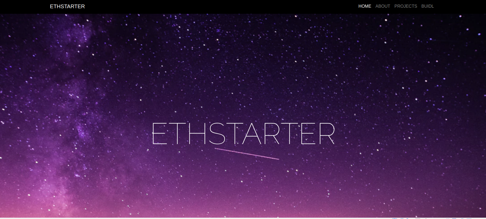

# ETHSTARTER
 Ethstarter was born out of a vision that technology has the significant unharnessed potential. Ethstarter is about bringing together people who believe in causes and want to support these worthy projects.

 
 
 ## The Vision
 Ethstarter possesses a vision of Blockchain Technology brining our society together to crowdfund resources for projects we believe in. It connects those with a vision and want crowdfund to BUIDL, with individuals who have financial capacity and believe in the power of technology.
 
 ## Target Group
 1. For developers and creatives, many of these individuals desire a platform to get both recognition and financial support for their new budding ideas. Ethstarter enables them to bring their idea to a new level by providing a platform to help their projects and products gain traction, validate their ideas and generate financial revenue.
 2. In the past, crowdfunding has been plagued with a bad reputation due to a minority of cases of unfufiled products and scams. As a result, many individuals lack trust in crowdfunding and are uncertain if their contributions will achieve the aim in mind. Enabled by Blockchain Smart Contracts, we seek to provide assurance that only when the predetermined conditions have been met, will the crowdfunder be able to retrieve the funds that have been contributed. This builds trust between the crowdfunder and supporters, generating a climate of generousity and supportiveness toward new intitatives..
 
 
 ## Deployment
 Ethstarter is best deployed in a Virtual Machine running Ubuntu 1804, with Ganache-CLI running on port 8545. These are the steps you'll need to get it up and running.
1. *git clone `https://github.com/DING0111/Ethstarter-Capstone.git`*
2. In the folder itself, run *ganache-cli*
3. *truffle migrate*
4. *npm run dev*

This will launch your browser (optimal viewing on Google Chrome). After logging into Metamask account and configuring it to localhost 8545, you can now freely interact with the contract through the user interface and have the ability to list your own crowdfunding projects and contribute test ether.

## Testing
The following tests have been implemented to ensure that the app is running as per expected. The following are the functions of each test:
1.	Ensure that 4 default projects are created during the initialization of the truffle project
2.	Ensure that the values of the 4 default projects are accurate
3.	Test that appropriate event is emitted when new contribution is made by user
4.	Test that appropriate event is emitted when new project is created by user
5.	Test that entries are accurate when new project is initiated by users
6.	Test that correct amount of ether is contributed to the specified project.

To run these tests, enter the command into the command line: ***truffle test***
